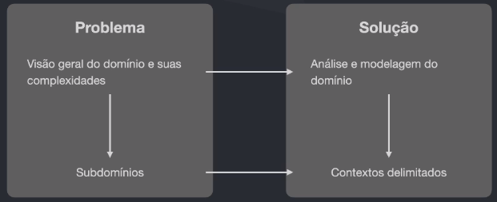

# Domain Driven Design
---

DDD = Clareza

### O que é DDD?
É um forma de desenvolver software com o **foco no coração da aplicação** - o que chamamos de domínio - tendo o objetivo de entender suas regras, processos e complexidades, separando-as assim de outros pontos complexos que normalmente são adicionados durante o processo de desenvolvimento.

### Da onde vem o DDD?
- Eric Evans
- Livro lançado em 2003
    - Filosofia
    - Exemplos gerais
    - Patters
- Comunidade de entusiastas seguindo essa prática
- Lançamento de outros livros

### Softwares complexos
- DDD é / deve ser aplicado para casos de projetos de software complexos
- Grandes projetos possuem muitas áreas, muitas regras de negócio, muitas pessoas com diferentes visões em diferentes contextos
- Não há como não utilizar técnicas avançadas em projetos de alta complexidade
- Grande parte da complexidade desse tipo de software não vem da tecnologia, mas sim da comunicação, separação de contextos, entendimento do negócio por diversoso ângulos
- Pessoas

### Como DDD pode ajudar?
- Entender com profundidade o domínio da aplicação
- Ter uma linguagem universal (linguagem ubíqua) entre todos os envolvidos
- Criar o design estratégico utilizando Bounded Contexts
- Criar o design tático para conseguir mapear e agregar as entidades e objetos de valor da aplicação, bem como os eventos de dominio
- Clareza do que é complexidade de negócio e complexidade técnica

### Resumindo
In short, DDD is primarily about modeling a Ubiquitous Language in a explicity Bounded Context.
*Vernon, Vaughn. Domain-Driven Design Distilled (p. 11).*

### Domínio e Subdominios

### Problema vc Solução

### O que é um contexto delimitado?
#### Bounded Contexts
A Bounded Context is an explicit boundary within which a domain model exists. Inside the boundary all terms ans phrases of the Ubiquitous Language have specific meaning, and the model replects the Language with exactness.
*Vernon, Vaughn. Implementing Domain-Driven Design*

### "Contexto é Reio"

**Contexto diferentes se comunicam/trabalham juntos.**
Em ambos contextos o cliente é o mesmo, porém a perspectiva **é diferente**.

### Modelagem estratégica / Context Mapping

- ACL : Camada Anti Corrupção

### Padrões e Starter Kit
- Partnership
- Shared Kernel
- Customer-Supplier Development
- Conformist
- Anticorruption-layer
- Open host service
- Published language
- Separate ways
- Big Ball of Mud

https://github.com/ddd-crew/context-mapping